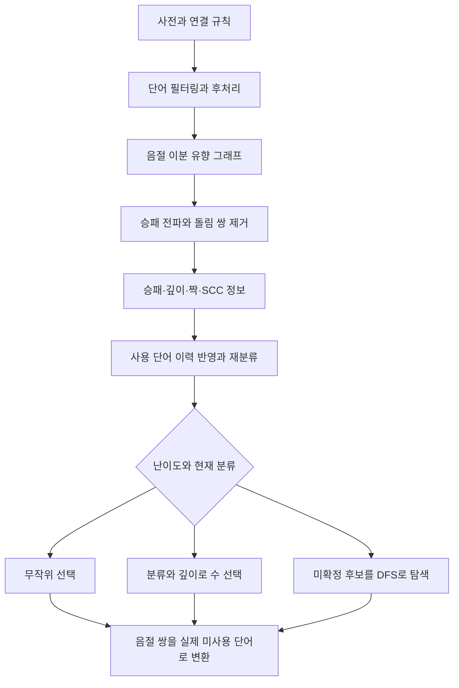

# 원본 AI의 동작 방식

분석 기준: 2026-10-06, 저장소 커밋 `5dab9b3`의 `game-ai/` 소스. 여기서 **원본**은 이 저장소에 추출되어 있는 TypeScript 엔진을 뜻한다. 외부 프로젝트의 최신 버전을 비교한 문서는 아니다. Rust 포팅의 변경점은 [별도 문서](rust-port-differences.md)에 정리했다.

## 1. 전체 방식

원본 AI는 **사전을 음절 그래프로 만들고, 승패 전파와 그래프 축소로 쉬운 상태를 판정한 뒤, 남은 상태를 깊이 우선 탐색하는 끝말잇기 엔진**이다. 분석한 코드에는 모델 학습, 신경망 추론, LLM 호출이 없다. 사전과 연결 규칙, 사용한 단어 이력, 탐색 우선순위를 입력으로 사용한다.

분석 결과가 `route`라는 것은 정적 분석으로 승패를 아직 결정하지 못했다는 뜻이다. 무승부를 뜻하지 않으며, 추가 탐색으로 승패가 확정될 수 있다.

## 2. 사전과 게임 그래프

### 사전 구성

`loadWords()`는 수동 입력 또는 선택한 사전 URL에서 단어를 읽는다. 선택 사전의 여러 URL은 중복 제거 후 `Promise.all()`로 다운로드한다. 그다음 추가 단어를 합치고, 삭제 단어를 제외하며, `^regexFilter$` 정규식으로 필터링하고 중복과 빈 단어를 제거한다. 같은 단어가 여러 번 들어 있으면 첫 등장 순서를 유지한다.

`getWcData()`는 규칙에 지정된 위치의 문자를 단어의 시작·끝 음절로 사용한다. 보통 첫 글자와 마지막 글자이지만, 역방향이나 내부 문자 연결도 가능하다. 한방 단어 제거 등 후처리와 후처리 단계의 단어 추가·삭제까지 적용한 뒤 `WordSolver`를 만든다.

근거: [load-data.ts](../game-ai/src/wordchain/word/load-data.ts)의 `loadWords()`, [engine-functions.ts](../game-ai/src/ai/engine-functions.ts)의 `getWcData()`.

### 음절을 두 위치로 나누는 이유

실제 엔진은 두음 법칙 등 변환을 표현할 수 있는 **이분 유향 다중 그래프**를 사용한다. 같은 글자도 위치에 따라 서로 다른 정점이다.

| 위치·간선 | 의미 | 예 |
| --- | --- | --- |
| `pos = 0` | 이전 단어에서 받은 끝 음절 | 상대가 `나리`를 두면 `(0, 리)` |
| `pos = 1` | 이번 단어의 시작 음절 | 두음 법칙으로 `(1, 이)` 선택 가능 |
| `0 → 1` | 연결 규칙에 따른 음절 변환 | `리 → 이`; 같은 글자를 유지하는 변환도 규칙에 따라 포함 |
| `1 → 0` | 단어를 사용하는 이동 | `이름`: `(1, 이) → (0, 름)` |

`0 → 1` 변환에서는 플레이어가 바뀌지 않는다. `1 → 0`에서 단어 하나를 사용하면 상대 차례가 된다. 따라서 두 위치에 같은 승패 반전 규칙을 적용하면 안 된다.

첫·끝 음절이 같은 여러 단어는 하나의 단어 간선에 개수로 저장한다. `가나`, `가시나`가 있으면 `(가, 나)` 간선 개수는 2다. `WordMap`은 그 쌍에 속한 실제 단어 배열을 따로 보관한다. 수읽기는 음절 쌍과 남은 개수로 진행하고, 최종 선택에서 구체적인 단어로 돌아온다.

이때 `outDegree()`는 단어 수의 합이 아니라 서로 다른 도착 정점의 개수다. 루프 조건의 차수와 남은 단어 개수를 구분해야 한다.

11개 음절 변환과 기본 규칙·우선순위 데이터가 포함되어 있다. 규칙을 바꾸면 변환 간선이 달라지지만 그래프 분석 절차는 공통이다.

근거: [bipartite-digraph.ts](../game-ai/src/wordchain/graph/bipartite-digraph.ts)의 `fromWordMap()`·`getMovesFromNode()`, [word-map.ts](../game-ai/src/wordchain/word/word-map.ts), [change.ts](../game-ai/src/wordchain/rule/change.ts).

## 3. 정적 승패 분석과 그래프 축소

`GraphSolver`는 그래프를 아래 세 파티션으로 분리한다. 제거된 단어도 원래 사전에서 지워지는 것은 아니며, 이후 단어 조회와 짝 대응에 사용된다.

| 파티션 | 내용 |
| --- | --- |
| `winlose` | 승패가 결정된 부분 |
| `removed` | 돌림 대응으로 축소한 단어 간선 |
| `route` | 아직 승패가 결정되지 않은 부분 |

### 승패 전파

`pruneWinLoseNodes()`는 둘 수 없는 정점과 강제 루프를 시작점으로 삼고, LIFO 스택으로 판정을 역방향 전파하면서 결정된 부분을 `winlose`로 옮긴다.

- **시작 음절 위치 1**: 상대에게 패배 상태인 끝 음절을 줄 수 있으면 승리다. 가능한 끝 음절이 모두 승리 상태라면 패배로 판정한다. 강제 루프는 별도 처리한다.
- **받는 음절 위치 0**: 이번 플레이어가 승리하는 시작 음절로 변환할 수 있으면 승리다. 가능한 변환이 모두 패배라면 패배다. 이 단계에서는 차례가 바뀌지 않는다.
- 출력 분류는 `win`, `lose`, `loopwin`, `route`이며, AI가 승패만 볼 때는 `loopwin`을 `win`으로 정규화한다.

예를 들어 두음 법칙 없이 사전이 `사과`, `과자`, `자두`라면, `두`로 시작할 차례인 사람은 둘 단어가 없어 패배한다. `자`는 `자두`로 이기고, `과`는 상대에게 승리 상태인 `자`를 주므로 패배한다.

### 강제 루프와 돌림 쌍

특정 시작 음절에서 끝 음절 하나만 선택할 수 있고, 그 끝 음절의 변환도 해당 시작 음절로만 돌아오면 강제 루프가 된다. 그 음절 쌍의 단어가 짝수 개라면 두 개씩 대응시켜 축소할 수 있고, 홀수 개라면 마지막 한 단어를 쓰는 쪽이 이기는 `loopwin` 판정을 얻는다. 두음 법칙이 있으면 시작·끝 글자가 서로 달라도 이런 루프가 생길 수 있다.

별도의 `getEvenLoops()`와 `getTwoCycles()`는 제거 가능한 짝수 루프와 두 단어 순환을 찾는다. 두 단어 쌍은 한쪽 단어에 상대가 대응 단어로 응수하여 순환을 닫을 수 있다는 구조를 이용한다. 서로 마주 보는 단어를 무조건 제거하는 방식은 아니다.

현재 `getSingleInOutEdges()`는 다음 두 목록을 합치고 같은 튜플의 중복을 제거한다.

| 후보 생성 | 실제 반환 튜플 |
| --- | --- |
| 위치 1 시작 음절의 진입 차수가 1 | `(시작 음절, 선행 끝 음절)` |
| 위치 0 끝 음절의 진출 차수가 1 | `(끝 음절, 후속 시작 음절)` |

첫 목록은 실제 변환 간선과 반대 방향의 튜플을 반환한다. 따라서 이 함수를 단순히 동일 방향 변환 간선의 차수 조건으로 해석하면 부정확하다. Rust도 이 튜플 순서를 유지한다. `getEvenLoops()`는 후보 `(start, end)`의 `getEdgeNum(end, start)`를, `getTwoCycles()`는 후보 두 개의 교차 단어 간선 개수를 검사한다. 두 간선의 대응 수는 남은 개수의 최솟값이며, 이미 짝지은 개수는 중복 사용하지 않는다.

`PairManager`는 제거한 개수와 대응 단어 인덱스를 보관한다. 같은 음절 쌍의 배열에서도 `removed`·`winlose`·`route`가 차지하는 인덱스 구간을 구분하므로, 제거된 쌍과 아직 쓸 수 있는 단어를 연결할 수 있다.

근거: [classify.ts](../game-ai/src/wordchain/graph/classify.ts)의 `pruneWinLoseNodes()`·`classify()`, [bipartite-digraph.ts](../game-ai/src/wordchain/graph/bipartite-digraph.ts)의 `getSingleInOutEdges()`·`getEvenLoops()`·`getTwoCycles()`, [pair-manager.ts](../game-ai/src/wordchain/graph/pair-manager.ts).

### `flow`가 바꾸는 것

| 설정 | 한 반복에서의 순서 |
| --- | --- |
| `flow = 0` | 승패 전파와 강제 루프 처리 → 짝수 루프 제거 → 두 단어 순환 제거 |
| `flow = 1` | 짝수 루프 제거 → 두 단어 순환 제거 → 승패 전파와 강제 루프 처리 |

변화가 없을 때까지 반복하되 코드에는 **최대 200회** 제한이 있다. `flow`는 분류·제거 순서를 선택하는 값이다. solver 생성과 이력 재분류에는 같은 설정을 사용하는 것이 좋다. 아래 DFS 전처리는 별도 함수이며 `flow`를 입력받지 않는다.

## 4. 깊이, 최적 수, SCC와 전략 트리

`getDepthMap()`은 `winlose` 그래프에서 종료 상태부터 깊이를 역전파한다. 깊이는 변환 간선 개수를 세지 않고 **단어 사용 횟수**를 기준으로 계산한다. 이미 제거한 돌림 쌍을 모두 실제로 주고받는 대국 길이를 뜻하지는 않는다. `route`에는 정적 깊이가 정의되지 않는다.

`getWinningOptimalMove()`는 상대가 패배하는 수 중 빠르게 끝나는 수를 고른다. `getLosingOptimalMove()`는 패배를 늦추는 수를 선택하려는 구조다. 변환을 먼저 고르는 위치 0과 단어를 고르는 위치 1을 구분하며, 루프승에서는 저장된 루프 대응을 사용한다. 동률 선택은 배열 순서와 전파 스택 순서에도 영향을 받는다.

다만 원본 `getLosingOptimalMove(0, ...)`의 기존 정점 분기는 위치 1 후보 이름을 `depthMap[0]`으로 비교하고, 없는 정점의 대체 분기는 위치 1 깊이의 작은 값을 고른다. 따라서 이 API의 모든 분기가 실제 최장 패배 수순을 정확히 반환한다고 일반화할 수는 없다. Rust도 이 선택 특성을 유지한다.

승패 축소가 끝난 `route` 그래프에는 Tarjan 계열 DFS로 **강한 연결 요소(SCC)** 정보를 만든다. SCC는 주요 루트 목록, 연결 관계, 분포와 단어 분류를 위한 분석 정보다. SCC에 속했다는 이유만으로 승리나 패배를 확정하지 않으며, 실제 DFS의 승패 판정은 SCC 결과를 직접 사용하지 않는다.

`getRouteNodes(pos)`는 조회 위치에서 해당 SCC에 속한 음절이 **3개 이상이면 주요 루트**, 3개 미만이면 나머지 목록으로 나눈다. 기존 설명의 거대 종착 SCC라는 개념을 그대로 구현한 판정으로 해석하면 안 된다.

반면 `getMaxRouteInfo()`의 통계 대상은 양쪽 위치의 정점 수를 합하여 3개 이상인 SCC다. 목록 조회와 통계 조회의 크기 기준도 구분해야 한다.

`WcStrategyTree`는 정적으로 승패가 결정된 상태의 승리 수와 상대 응수 목록을 펼치는 기능이다. 사용자가 패배 쪽 응수의 인덱스를 바꾸면 그 이후 경로를 다시 펼친다. `route` 상태에서 바로 전략 트리를 만들면 오류가 발생한다. 이 기능은 미확정 상태를 검색하는 DFS와 구분된다.

근거: [classify.ts](../game-ai/src/wordchain/graph/classify.ts)의 `getDepthMap()`, [graph-solver.ts](../game-ai/src/wordchain/graph/graph-solver.ts)의 생성자·최적 수·루트 조회, [strategy-tree.ts](../game-ai/src/wordchain/graph/strategy-tree.ts).

## 5. 미확정 상태의 수읽기

`common.ts`의 `isWin()`은 다음 순서로 **재귀 DFS**를 수행한다.

1. 입력 수의 끝 음절에서 도달 가능한 부분 그래프만 남긴다.
2. 그 수의 단어 간선이 남아 있으면 개수를 하나 감소시킨다.
3. `checkInitialCondition()`으로 승패 전파 → 짝수 루프 제거 → 두 단어 순환 제거 → 승패 전파를 적용한다.
4. 다음 차례의 승패가 확정되면 즉시 반환한다.
5. 미확정이면 후보를 우선순위로 정렬하고 재귀 탐색한다. 상대를 패배시키는 응수 하나를 찾으면 나머지 후보는 검색하지 않는다.

각 분기에서 남은 단어 개수와 도달 가능한 그래프를 사용한다. 학습된 평가 함수, MCTS, 알파·베타 값이나 전이표를 사용하는 구현은 이 탐색 코드에 없다. 정적 판정과 그래프 축소, 도달성 축소, 승리 응수 발견 시 조기 종료가 탐색량을 줄인다.

후보 비교 `compareNextMoveNum()`은 먼저 간선 우선순위, 다음으로 끝 음절 우선순위를 비교한다. 값이 작을수록 먼저 탐색하며 기본값은 0이다. 그다음 설정된 휴리스틱을 사용한다. 기본 휴리스틱은 **후속 단어 개수 × 1000 − 이전 음절 쌍 개수 − 함정 구조 보너스**로, 상대의 선택지가 작은 수를 먼저 보는 경향이 있다. 우선순위는 탐색 순서를 바꾸며 자체로 승리를 증명하지 않는다.

반환 관점에 주의해야 한다. 내부 `isWin(graph, move, ...)`은 **그 수 이후 다음 차례인 사람**의 승패를 반환한다. 공개 `engineFunctions.searchIsWin()`과 스트리밍 결과의 `isWin`은 이를 뒤집어 **입력 수를 둔 사람**의 승패를 반환한다.

스트리밍 API는 탐색 스택의 복사본을 최대 1초에 한 번 전달하고, 마지막에 `isWin`, `duration`, `optimalPath`를 전달한다. `optimalPath`는 음절 쌍 배열이며, 가지치기로 판정된 이후의 실제 단어 수순을 끝까지 펼친 완전한 전략 증명은 아니다.

근거: [common.ts](../game-ai/src/ai/common.ts)의 `checkInitialCondition()`·`isWin()`, [engine-functions.ts](../game-ai/src/ai/engine-functions.ts)의 탐색 API, [bipartite-digraph.ts](../game-ai/src/wordchain/graph/bipartite-digraph.ts)의 `compareNextMoveNum()`.

## 6. 실제 게임의 수 선택

| 난이도 | 첫 수 | 이후 수 |
| --- | --- | --- |
| `0` 쉬움 | 가능한 음절 쌍을 무작위 선택 | 남은 합법적인 음절 쌍을 무작위 선택 |
| `1` 보통 | 루트 음절 쌍 무작위 선택; 루트가 없으면 최대 깊이의 시작 음절을 이용 | 승패가 결정되면 얕은 최적 수, 루트면 무작위 후보 |
| `2` 어려움 | 루트 후보를 섞은 뒤 탐색시간이 긴 후보를 선택; 루트가 없으면 최대 깊이의 시작 음절을 이용 | 승패가 결정되면 얕은 최적 수, 루트면 후보별 DFS로 첫 필승 수를 선택 |

무작위 선택의 단위는 모든 개별 단어가 아니라 **음절 쌍**이다. 같은 쌍에서 실제 단어를 고를 때는 사전 배열의 첫 미사용 단어를 사용한다. 따라서 같은 쌍에 단어가 많아도 해당 쌍의 추첨 확률이 개수만큼 증가하지 않는다.

어려움의 일반 턴에서는 탐색이 시간 초과 또는 오류로 끝난 후보를 즉시 선택한다. 모든 후보가 패배로 판정되면 첫 단어 뺏기를 시도하거나, 측정된 탐색시간이 가장 긴 후보를 고른다. **탐색시간이 길다는 것은 실제 대국에서 가장 오래 버틴다는 보장이 아니다.**

첫 수의 `takeDragingWord()`는 일반 턴과 다르다. 승리·패배 결과를 모두 탐색시간 목록에 넣고 가장 오래 걸린 후보를 선택한다. 필승 수를 발견했다고 바로 선택하지 않는다. 모든 탐색이 끝나면 `필패 확정` 로그를 무조건 출력하는데, 이 첫 수 로그는 실제 승패의 증거로 사용할 수 없다.

근거: [game-worker-runner.ts](../game-ai/src/ai/game-worker-runner.ts)의 `run()`·`takeRandomRouteWord()`·`takeDragingWord()`·`getWord()`.

### 이력, 뺏기, 종료

사용 이력은 단어 문자열로 중복 제거한 뒤 음절 쌍별 사용 개수로 변환한다. 같은 음절 쌍의 다른 단어는 각각 하나씩 소비하고, 첫 단어를 뺏어 같은 문자열이 두 번 기록되었으면 한 번만 소비한다. 현재 단어의 끝 음절과 남은 그래프로 매 턴 재분류한다.

`stealable`이 켜져 있고 이력 길이가 정확히 1이면 상대의 첫 단어를 그대로 낼 수 있다. 보통·어려움은 현재 상태가 패배일 때 뺏기를 사용한다. `isGameEnd()` 역시 이 상황은 종료로 처리하지 않는다. 쉬움에서 합법적인 일반 응수가 하나도 없는 뺏기 상황은 원본 수 선택의 별도 취약점이며 Rust 차이 문서에 정리했다.

선택 후 콜백 순서는 `move` → 상대의 응수가 없으면 `computerWin` → `messageEnd`다. `debug` 이벤트는 선택 과정에서 추가로 전달된다. 원본 호출자는 일반적인 종료 상태를 먼저 `isGameEnd()`로 확인해야 한다.

### 워커와 시간제한

이 저장소의 원본 패키지는 Node.js `worker_threads`의 워커에서 사전 구성·재분류·탐색을 실행한다. `GameWorkerRunner`는 후보를 **순서대로** `WorkerRunner.callAndTerminate()`에 전달한다. 이 과정은 여러 후보를 동시에 분산 탐색하는 방식이 아니다.

`calculatingDuration`은 **후보 하나당 초 단위 제한**이다. 워커 호출에는 밀리초로 변환해 전달한다. 제한을 넘기면 워커를 종료하여 호출을 실패시킨다. 워커 생성과 결과 전달 비용도 있으므로 후보별 측정 탐색시간과 외부 호출 시간은 다르다. 여러 후보를 검사하는 전체 턴 시간은 이 제한보다 길어질 수 있다.

직접 호출하는 동기 `searchIsWin()`에는 자체 시간제한이 없다. 제한과 취소는 `WorkerRunner`가 담당한다. 반환 `duration`은 밀리초이고, 스트리밍 `done.duration`은 소수 둘째 자리로 반올림한 초다.

근거: [worker-runner.ts](../game-ai/src/ai/worker-runner.ts), [worker-entry.ts](../game-ai/src/ai/worker-entry.ts), [game-worker-runner.ts](../game-ai/src/ai/game-worker-runner.ts).

## 7. 기존 설명 문서를 읽을 때의 기준

`game-ai/docs/`에는 그래프 모델과 알고리즘 배경 설명이 있다. 다만 다음은 현재 소스를 기준으로 해석해야 한다.

- 두음 돌림 쌍 설명에 나오는 일반적인 후속 집합 포함 관계 검사는 현재 코드에 구현되어 있지 않다. 실제로는 위의 차수 조건과 방향이 다른 후보 튜플을 사용한다.
- 주요 루트 목록은 현재 `getRouteNodes()`의 SCC 크기 기준으로 구분한다.
- 정적 `route` 분류, 탐색의 승패, 첫 수의 디버그 로그는 서로 다른 정보다.
- 전처리가 쉬운 부분을 해결해도 큰 루트 영역의 DFS는 많은 시간이 필요할 수 있다. 난이도 2도 제한시간 안에 모든 상태를 해결한다는 보장은 없다.

포팅에서 유지한 내용, 달라진 인터페이스와 추가 API는 [Rust 포팅 차이](rust-port-differences.md)를 참고한다.
